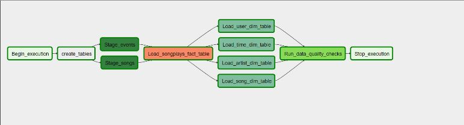
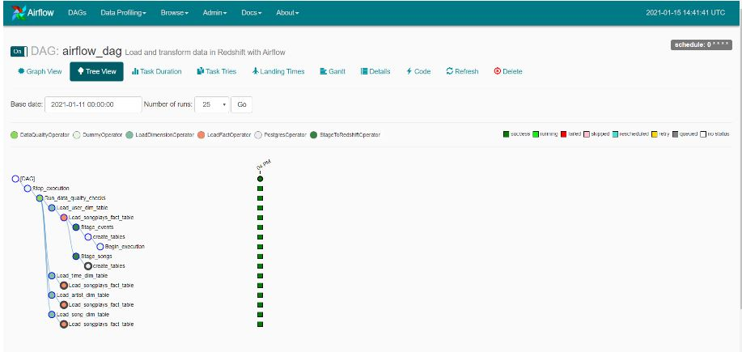

# Data Pipelines with Airflow

A music streaming company, Sparkify, has decided that it is time to introduce more automation and monitoring to their data warehouse ETL pipelines and come to the conclusion that the best tool to achieve this is Apache Airflow.

In this project, I will create high grade data pipelines that are dynamic and built from reusable tasks, can be monitored, and allow easy backfills. The data quality plays a big part when analyses are executed on top the data warehouse. I want to run tests against the datasets after the ETL steps have been executed to catch any discrepancies in the datasets.

The source data resides in S3 and needs to be processed in Sparkify's data warehouse in Amazon Redshift. The source datasets consist of JSON logs that tell about user activity in the application and JSON metadata about the songs the users listen to.

# Source Data
For this project, two working datasets provided by Udacity. Here are the s3 links for each:

* Log data: `s3://udacity-dend/log_data`

{"num_songs": 1, "artist_id": "ARJIE2Y1187B994AB7", "artist_latitude": null, "artist_longitude": null, "artist_location": "", "artist_name": "Line Renaud", "song_id": "SOUPIRU12A6D4FA1E1", "title": "Der Kleine Dompfaff", "duration": 152.92036, "year": 0}

* Song data: `s3://udacity-dend/song_data`

{"artist":"Slipknot","auth":"Logged In","firstName":"Aiden","gender":"M","itemInSession":0,"lastName":"Ramirez","length":192.57424,"level":"paid","location":"New York-Newark-Jersey City, NY-NJ-PA","method":"PUT","page":"NextSong","registration":1540283578796.0,"sessionId":19,"song":"Opium Of The People (Album Version)","status":200,"ts":1541639510796,"userAgent":"\"Mozilla\/5.0 (Windows NT 6.1) AppleWebKit\/537.36 (KHTML, like Gecko) Chrome\/36.0.1985.143 Safari\/537.36\"","userId":"20"}

# Design
The source data is located in Amazon S3. Destination is Amazon Redshift, where I will store the tables in the following schema.

* Fact Table

songplays - records in log data associated with song plays on the page NextSong

Fields - `songplay_id, start_time, user_id, level, song_id, artist_id, session_id, location, user_agent`

* Dimension Tables

users - users in the app 

Fields - `user_id, first_name, last_name, gender, level`

songs - songs in music database 

Fields - `song_id, title, artist_id, year, duration`

artists - artists in music database

Fields - `artist_id, name, location, lattitude, longitude`

time - timestamps of records in songplays broken down into specific units 

Fields - `start_time, hour, day, week, month, year, weekday`

# Project structure
## Airflow
### dags
- pipleline.py - The main Airflow DAG for the data pipeline
- sql_queries.py - Part of insert sql queries used to load data
### plugins
   #### operators
- stage_redshift.py - Airflow custom operator to read JSON files from S3 to Redshift
- load_fact.py - Airflow custom operator to load the fact table in Redshift
- load_dimension.py - Airflow custom operator to load dimension tables in Redshift
- data_quality.py - Airflow custom operator for checking data quality in Redshift
#### helpers
- create_tables.sql - Contains data definition langauge (DDL) statements to create tables in Redshift
## README.MD

A screenshot below shows DAG structure on Airflow:

A screenshot below shows DAG run history in a tree view on Airflow:

